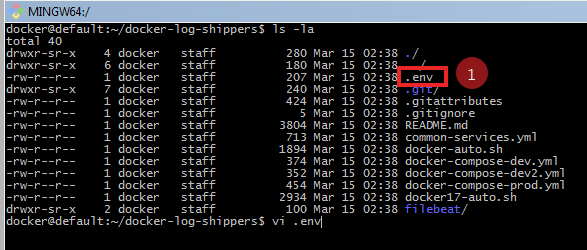
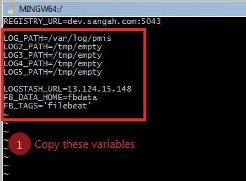
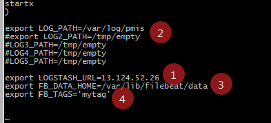
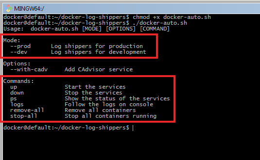
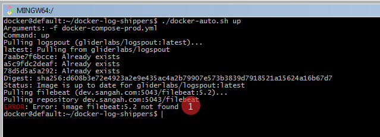
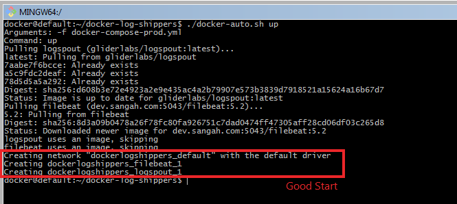
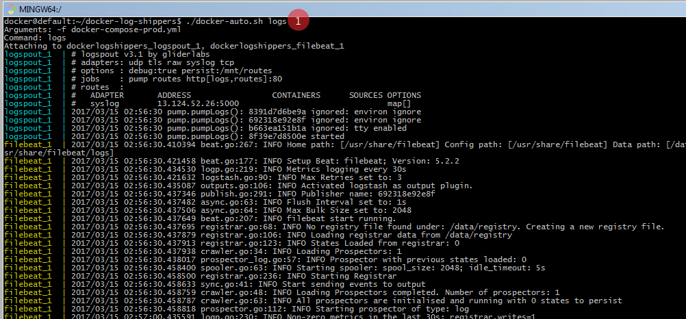

# Filebeat setup & run instructions

Test if *git*, *Docker* and *Docker Compose* are installed

---

Install Docker Compose

---

From our github page go to the repository *docker-log-shippers*

---

Click the button *Clone or download* and copy the url tha show up.

---

From the home folder of the user run `git clone` with the url copied
and a new directory will be created just under the current one.

---

Explore the folder structure and you will notice a file named `.env`,
here you find all the variables required to run the service.

**Don't edit this file, these are default values only**

---

Copy the key value from inside the file and we are going to put them on another file.

---

Put the copied content inside the file `~/.bashrc`
and add a prefix `export` to them and change the values accordingly.

---

With the command below you set those variables to the new values.

---

Almost ready to run the service, go to the service folder
and you see two files `docker-auto.sh` and `docker17-auto.sh`.

**If on Centos 7 or Ubuntu use the former otherwise if on Centos 7 the latter**

---

Run the script without passing parameters and you will be presented with an help message.

---

Run the service with the command below.
If is the first time you use docker on this machine, you might have the error shown on the image.
It means you need to login to our registry first.

---

Login to our registry with the following commands, and make sure it ends with the message
*Login Succeded*.

---

Start the service with the command below.

---

Show the services status with the following command.

---

Follow the logs

---

Stop the service.

---

Done!